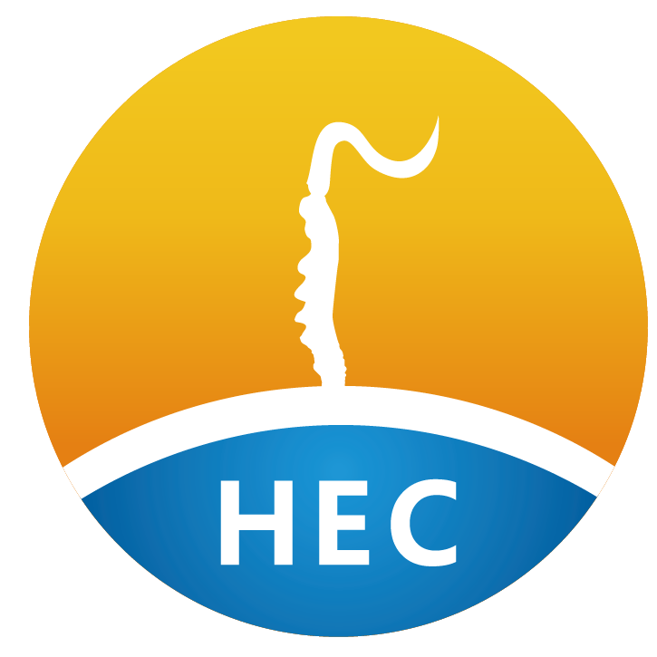
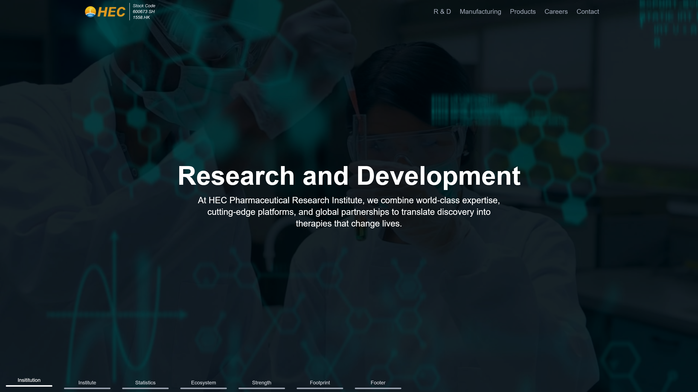
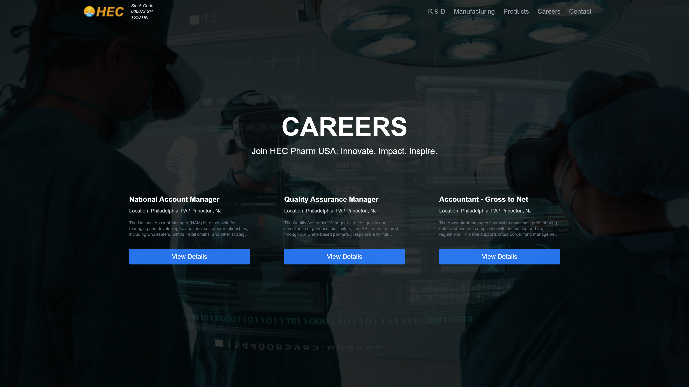
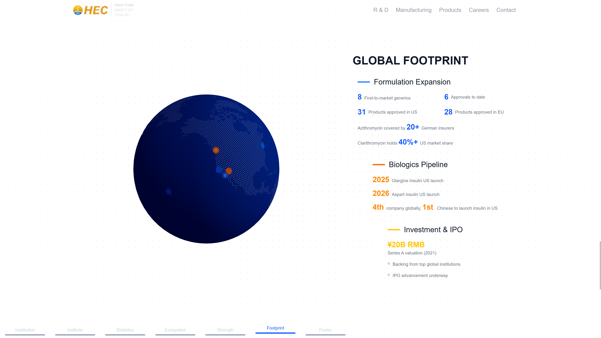
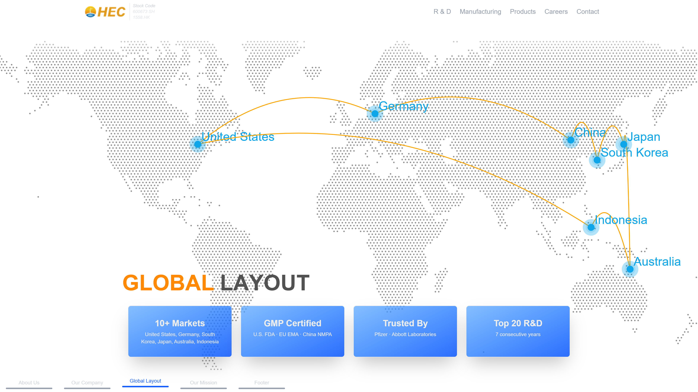
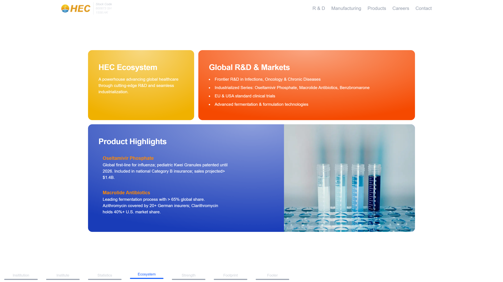
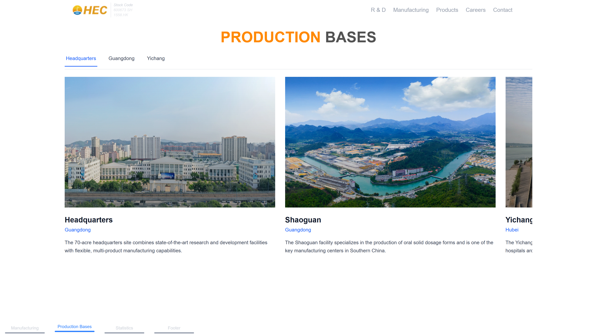
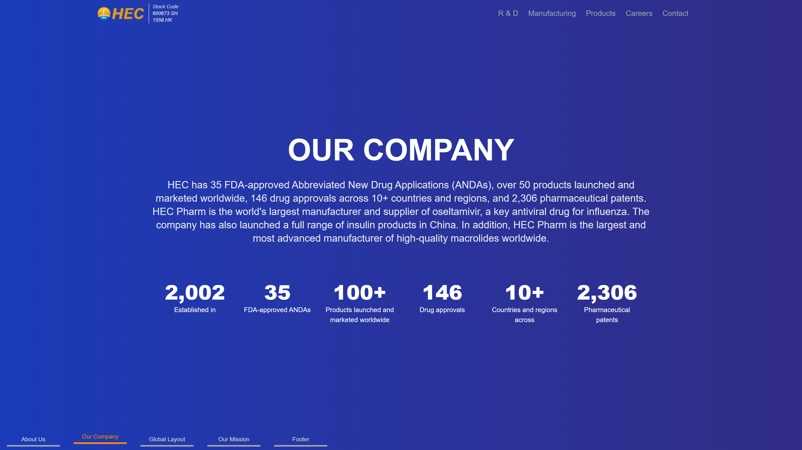
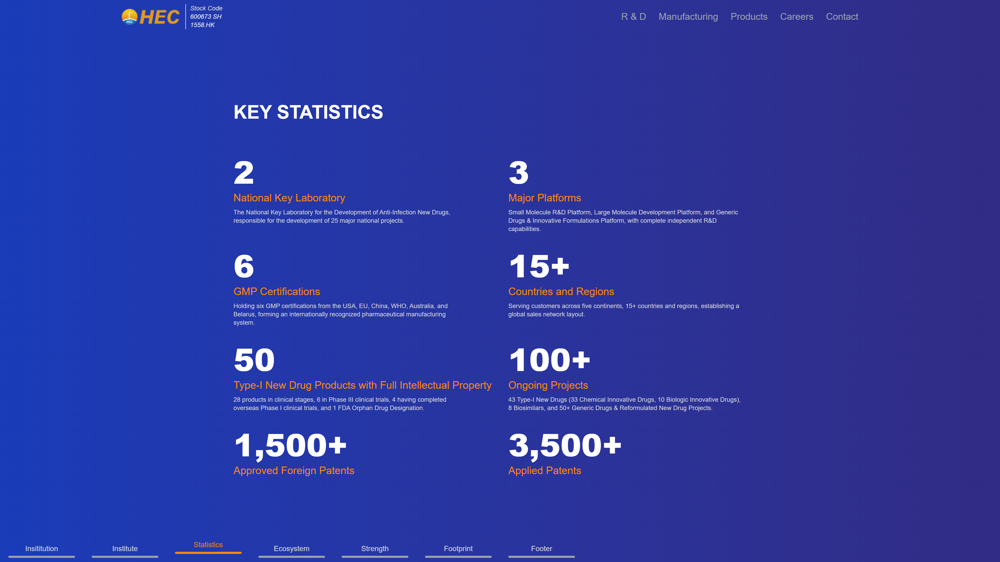
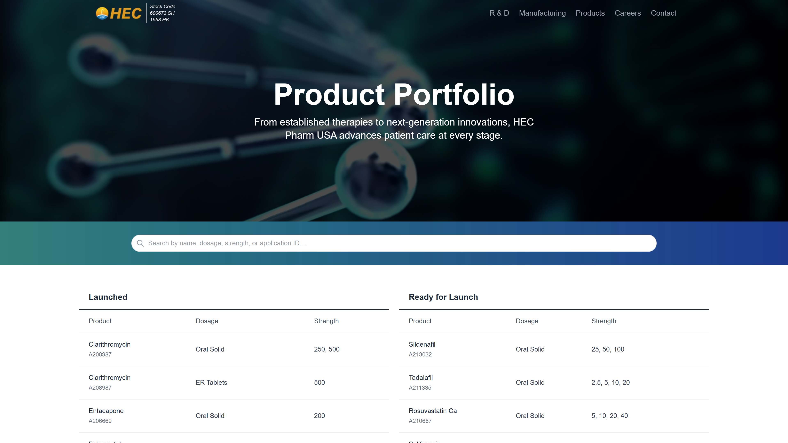

# HEC Pharm 3D Interactive Webpage Showcase

> **Note**: This is a showcase repository. The source code is proprietary and protected under NDA. This repository demonstrates the project's features, architecture, and outcomes without exposing confidential code.

<div align="center">
  
  
  ### 🧬 Next-Generation Pharmaceutical Webpage
  
  [](https://nextjs.org/)
  [](https://www.typescriptlang.org/)
  [](https://threejs.org/)
  []()
  
  <br />
  
  ### 🌐 [View Live Demo](https://www.hecpharm.us/)
  
  <a href="https://www.hecpharm.us/" target="_blank">
    
  </a>
</div>

---

## 🎯 Project Overview

Developed an enterprise-grade interactive webpage for HEC Pharm USA, revolutionizing how medical professionals interact with pharmaceutical data through cutting-edge 3D visualizations and immersive user experiences.

**🔗 Live Website: [https://www.hecpharm.us/](https://www.hecpharm.us/)**

### 🎭 The Challenge

HEC Pharm needed a modern webpage that could:
- Present complex molecular data in an intuitive, interactive format
- Engage medical professionals with immersive 3D visualizations
- Maintain enterprise-level security and performance

### 💡 The Solution

Built a full-stack application leveraging the latest web technologies to create an unparalleled user experience combining scientific accuracy with stunning visuals.

---

## ✨ Key Features

> Experience these features live at [www.hecpharm.us](https://www.hecpharm.us/)

### 🌍 Interactive 3D Globe
- Real-time data visualization on a rotating globe
- Smooth camera controls and animations
- Custom markers and heat maps

### 🧪 Molecular Visualization
- 3D molecular structure rendering
- Interactive rotation and zoom
- Real-time property calculations
- Educational annotations

### 📊 Dynamic Dashboards
- Live data updates
- Customizable widgets
- Advanced filtering and search

### 🎬 Multimedia Integration
- Immersive videos
- Interactive tutorials
- 3D interactive objects
- Mobile-first approach

---

## 🛠️ Technical Architecture

### Frontend Stack
```
├── Framework: Next.js 15.3.1 (App Router)
├── Language: TypeScript 5
├── 3D Graphics: Three.js + React Three Fiber + Drei
├── Animations: Framer Motion 12.9
├── Styling: Tailwind CSS 4.1.4
├── State Management: React Hooks + Context
└── Build Tool: Turbopack
```

### Key Dependencies
- **@react-three/fiber**: React renderer for Three.js
- **@react-three/drei**: Useful helpers for React Three Fiber
- **framer-motion**: Production-ready animation library
- **three-globe**: 3D globe visualization
- **@emailjs/browser**: Email integration
- **react-player**: Video player component

### Performance Optimizations
- Lazy loading for 3D models
- Texture compression and optimization
- Code splitting and dynamic imports
- Service worker caching
- CDN asset delivery

---

## 📸 Screenshots

<div align="center">
  <p><em>Click any screenshot to visit the live site</em></p>
</div>

<div align="center">
  <h3>🏠 Immersive Landing Heroes</h3>
  <a href="https://www.hecpharm.us/" target="_blank">
    
  </a>
  <a href="https://www.hecpharm.us/" target="_blank">
    
  </a>
  <!-- <p><em>Immersive landing heroes</em></p> -->
</div>

<div align="center">
  <h3>🌍 3D Interactive Objects</h3>
  <a href="https://www.hecpharm.us/" target="_blank">
    
  </a>
  <a href="https://www.hecpharm.us/" target="_blank">
    
  </a>
  <!-- <p><em>Real-time global pharmaceutical data visualization</em></p> -->
</div>

<div align="center">
  <h3>🧬 Molecular Blocks</h3>
  <a href="https://www.hecpharm.us/" target="_blank">
    
  </a>
  <a href="https://www.hecpharm.us/" target="_blank">
    
  </a>
  <!-- <p><em>Interactive 3D molecular structure exploration</em></p> -->
</div>

<div align="center">
  <h3>📱 Live Statistics</h3>
  <a href="https://www.hecpharm.us/" target="_blank">
    
  </a>
  <a href="https://www.hecpharm.us/" target="_blank">
    
  </a>
  <!-- <p><em>Fully responsive design optimized for all devices</em></p> -->
</div>

<div align="center">
  <h3>📊 Searchable Products List</h3>
  <a href="https://www.hecpharm.us/" target="_blank">
    
  </a>
  <!-- <p><em>Comprehensive data analytics and reporting</em></p> -->
</div>

---

## 🚀 Experience the Live Demo

<div align="center">
  <h3>Visit the production website to experience all features:</h3>
  
  <a href="https://www.hecpharm.us/" target="_blank">
    
  </a>
  
  <p><em>Best viewed on desktop for full 3D experience</em></p>
</div>

---

<div align="center">
  <sub>Built with ❤️ using Next.js, Three.js, and modern web technologies</sub>
  <br />
  <sub>Live at <a href="https://www.hecpharm.us/">www.hecpharm.us</a></sub>
</div>

---

**⚠️ Confidentiality Notice**: This showcase represents work performed under NDA. All code, specific implementation details, and proprietary information remain confidential. Screenshots and descriptions have been approved for public display.
